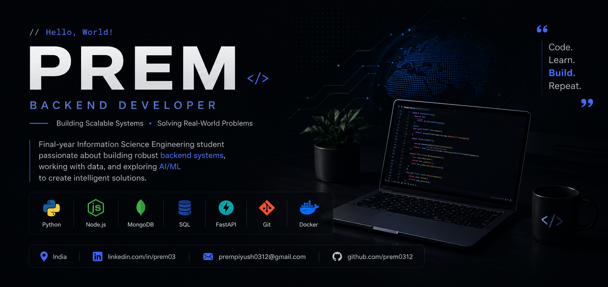

<p align="center">
  <a href="https://github.com/prem0312">
    
  </a>
</p>

[](https://git.io/typing-svg)

<p align="center">
  <a href="https://linkedin.com/in/prem03">
    
  </a>

  <a href="mailto:prempiyush0312@gmail.com">
    
  </a>

  <a href="https://github.com/prem0312">
    
  </a>

  <a href="https://prem03.dev">
    
  </a>
</p>

<p align="left">
  
</p>

## 💻 About Me

```bash
$ whoami

> Final-year Information Science Engineering student
> Backend Developer
> Learning AI/ML and System Design
> Building scalable applications
```

## 📊 GitHub Stats

<p align="center">
  
  
</p>

## 🎯 Current Focus
```
- 🔭 Building backend applications with **FastAPI** and **Node.js**
- 🌱 Learning **Machine Learning**, **System Design**, and **Docker**
- 💡 Exploring **AI-powered applications**
- 🚀 Preparing for **Backend Developer** and **Software Engineer** roles
```